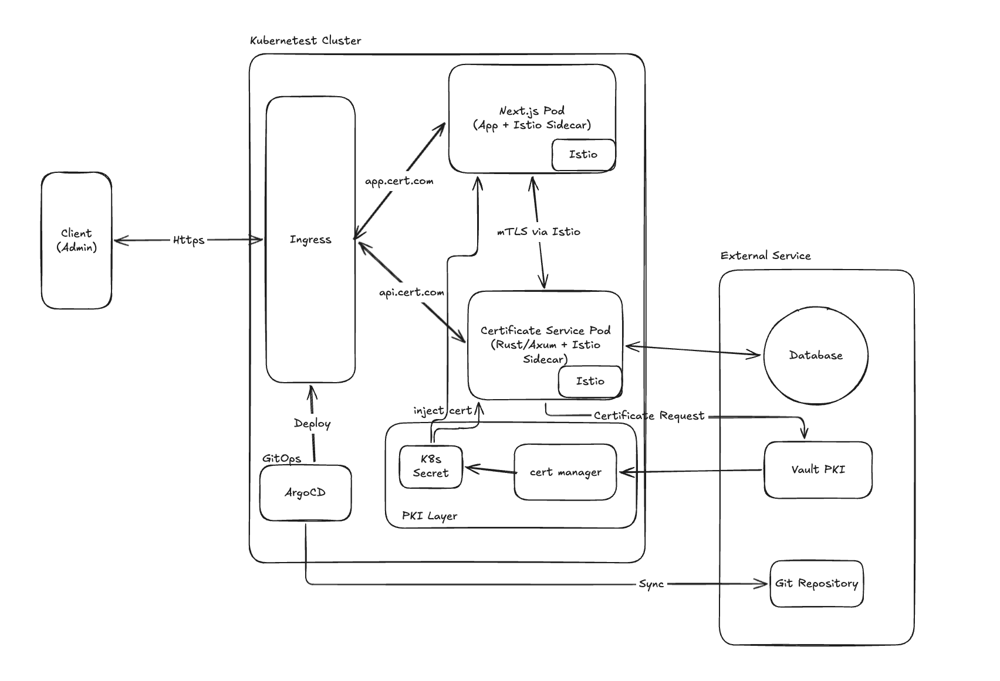

# Certificate Issuance and Inventory Microservice
## High-Level Design

---

## 1. Overview
## 2. Functional Requirements
## 3. Non-Functional Requirements
## 4. System Architecture
   - Component diagram
   - Component responsibilities
   - Technology choices & rationale
## 5. API Design (high-level)
## 6. Data Storage Strategy
## 7. Security Architecture
   - TLS/mTLS strategy
   - Key management
## 8. Kubernetes Infrastructure
   - High-level component overview
   - Scaling strategy
## 9. Observability Strategy
## 10. Trade-offs & Design Decisions

---

## 1. Overview

A secure, cloud-native microservice for issuing and managing X.509 certificates for Non-Human Identities (NHI) — AI agents, service accounts, and machine identities within an enterprise.

### Problem Statement

In modern microservice environments, services need to prove their identity to each other. X.509 certificates are the foundation of this trust. Without a centralized system to manage these certificates:

- Certificates expire unnoticed → service outages
- No visibility into what certificates exist
- Manual rotation is error-prone at scale
- No audit trail

### Solution

A centralized certificate issuance and inventory microservice that:
- Issues and stores certificate metadata
- Provides visibility into all certificates
- Monitors expiration
- Integrates with real PKI infrastructure (Vault, cert-manager) in production

---

## 2. Functional Requirements

1. Issue X.509 certificates (Dummy CA)
2. Store certificate metadata in PostgreSQL
3. Retrieve certificate metadata by ID
4. List certificates with keyset pagination
5. Parse PEM files and auto-register certificate metadata
6. Expose secure API for Next.js frontend
7. Monitor certificate expiration (expiring within 30 days)

---

## 3. Non-Functional Requirements

| Requirement | Approach |
|---|---|
| Security | TLS, mTLS (Istio), HSM/KMS for key storage |
| Scalability | Kubernetes HPA autoscaling |
| Availability | Health probes, graceful shutdown, multiple replicas |
| Observability | Structured logging, metrics, tracing, request ID |
| Performance | Async Rust (Tokio), connection pooling, UUID v7 |
| Containerization | Multi-stage Docker, non-root user |

---

## 4. System Architecture

> 📊 **Diagram:** System architecture (Excalidraw)


### Production Architecture
```
Browser (Admin)
↓ HTTPS
Ingress (TLS termination)
├── app.example.com → Next.js
└── api.example.com → cert-service
↓
┌─────────────────────┐
│   cert-service      │
│   (Rust/Axum)       │
└─────────────────────┘
↓           ↓
PostgreSQL    Vault PKI
(metadata)  (real certs)
↓
cert-manager
↓
Kubernetes Secrets
↓
Istio sidecar
↓
Service A ←mTLS→ Service B
```

### Component Responsibilities

| Component | Responsibility |
|---|---|
| Next.js | Admin dashboard — SSR, certificate inventory UI |
| cert-service | Certificate issuance, metadata storage, API |
| PostgreSQL | Certificate metadata persistence |
| Vault PKI | Real certificate issuance, Private Key management |
| cert-manager | Certificate rotation automation |
| Istio | mTLS enforcement, sidecar injection |
| Ingress | TLS termination, external routing |
| ArgoCD | GitOps-based deployment management |

### In This Assessment
```
Browser
↓ HTTPS (self-signed)
Next.js (SSR + SWR)
↓ HTTPS
cert-service (Rust/Axum)
↓
PostgreSQL
```

> Vault PKI, cert-manager, and Istio are documented but not implemented. The assessment focuses on the certificate metadata management layer.

---

## 5. Technology Choices & Rationale

### Backend — Rust (Axum)

| Choice | Rationale |
|---|---|
| Rust | Memory safety, performance, no GC pauses — ideal for security-critical systems |
| Axum | Ergonomic routing, Tower middleware ecosystem, async-native |
| SQLx | Compile-time query verification, async PostgreSQL |
| Tokio | Industry-standard async runtime for Rust |
| UUID v7 | Time-ordered IDs, better DB index performance than UUID v4 |

### Frontend — Next.js

| Choice | Rationale |
|---|---|
| Next.js | SSR for fast initial load and SEO, TypeScript strict mode |
| SWR | Client-side data revalidation without full page reload |
| SSR + SWR | Best of both worlds — fast initial render + fresh data |

### Infrastructure

| Choice | Rationale |
|---|---|
| PostgreSQL | ACID compliant, reliable — deployed as AWS RDS managed service |
| HashiCorp Vault | External PKI — independent from Kubernetes cluster for security |
| Kubernetes | Industry standard for container orchestration |
| Istio | Automatic mTLS, observability, traffic management |
| ArgoCD | GitOps — Git as single source of truth |
| Docker multi-stage | Minimal runtime image, faster deploys |

---

## 6. API Design

| Method | Path | Description |
|---|---|---|
| POST | /certificates | Issue or register a certificate (JSON or PEM) |
| GET | /certificates | List certificates with keyset pagination |
| GET | /certificates/:id | Get certificate by ID |
| GET | /health/live | Liveness probe |
| GET | /health/ready | Readiness probe |

---

## 7. Data Storage Strategy

### Why PostgreSQL?
- ACID compliance — critical for certificate metadata integrity
- `TIMESTAMPTZ` for timezone-aware expiration dates
- `ARRAY_AGG` for efficient SAN entry joins
- Proven reliability for financial/security data

### Why AWS RDS over StatefulSet?

| | AWS RDS | StatefulSet |
|---|---|---|
| Operations | Managed | Manual |
| Backups | Automatic | Manual |
| Failover | Automatic (Multi-AZ) | Complex setup |
| Upgrades | Automatic | Manual |
| Cost | Higher | Lower |

> For a startup like Arkion, AWS RDS reduces operational overhead and lets the team focus on the core product.

### Schema Overview

```
certificates
├── id (UUID v7, PK)
├── subject
├── issuer
├── expiration (TIMESTAMPTZ)
└── created_at (TIMESTAMPTZ)
san_entries
├── id (UUID v7, PK)
├── certificate_id (FK → certificates)
└── value
```

### Key Design Decisions

| Decision | Reason |
|---|---|
| UUID v7 | Time-ordered, better B-tree index performance |
| SAN as separate table | Normalized, enables individual SAN querying |
| Keyset pagination | More efficient than offset for large datasets |
| JOIN + ARRAY_AGG | Avoids N+1 queries for SAN entries |

---

## 8. Security Architecture

> 📊 **Diagram:** Security layers (Excalidraw)

### External Communication (Browser → Ingress)
- TLS with CA-signed certificate
- Ingress handles TLS termination

### Internal Communication (Service → Service)
- mTLS enforced by Istio in STRICT mode
- All service-to-service traffic encrypted and authenticated
- No service can communicate without a valid certificate

### Key Management
- Development: local files (certs/)
- Production: AWS KMS or HashiCorp Vault
- Private Keys never stored in plaintext or database

### In This Assessment
- Self-signed TLS certificate (axum-server + rustls)
- mTLS documented — would use Istio in production
- Local key storage — would use KMS in production

---

## 9. Scalability & Availability

### Horizontal Scaling
- Kubernetes HPA scales based on CPU/memory
- Stateless service — any replica can handle any request
- PostgreSQL connection pooling (SQLx) prevents connection exhaustion

### High Availability
- Minimum 2 replicas in production
- Liveness probe → restart unhealthy pods
- Readiness probe → remove unready pods from load balancer
- Graceful shutdown → finish in-flight requests before stopping

### Deployment Strategy
- Rolling updates — zero downtime deployments
- ArgoCD App of Apps — GitOps-based, easy rollback
- Multi-stage Docker — minimal image size, faster deploys

---

## 10. Observability Strategy

| Pillar | In This Assessment | In Production |
|---|---|---|
| Logging | tracing + tracing-subscriber | ELK Stack / Datadog |
| Metrics | Not implemented | Prometheus + Grafana |
| Tracing | Request ID (tower-http) | OpenTelemetry + Jaeger |
| Probes | /health/live, /health/ready | Same + alerting |

---

## 11. Trade-offs & Design Decisions

| Decision | Chosen | Alternative | Reason |
|---|---|---|---|
| Pagination | Keyset | Offset | Better performance at scale |
| ID type | UUID v7 | UUID v4 / auto-increment | Time-ordered, better index performance |
| SAN storage | Separate table | PostgreSQL array | Normalized, queryable |
| mTLS | Istio (documented) | Manual implementation | Reduces complexity, automatic rotation |
| TLS termination | Ingress | App-level | Industry standard, separation of concerns |
| Frontend rendering | SSR + SWR | CSR only | Fast initial load + fresh data |
| Key storage | KMS (documented) | Local file | Security — Private Keys never in plaintext |
| Deployment | ArgoCD App of Apps | kubectl apply | GitOps, easy rollback |
