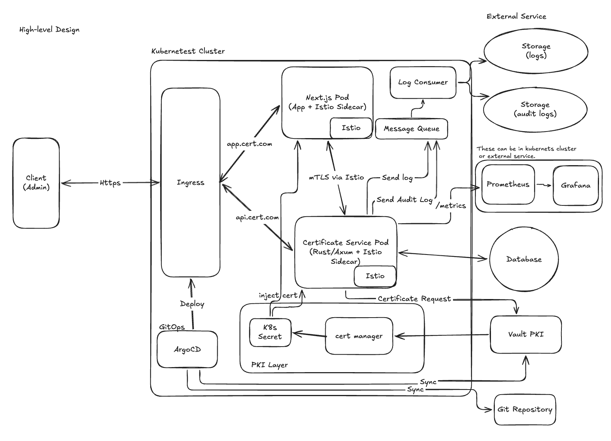
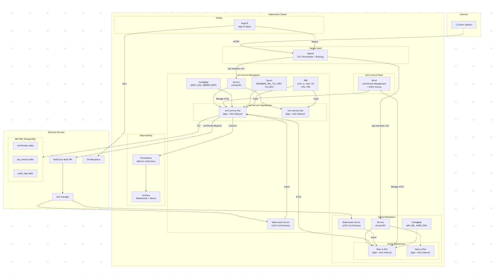
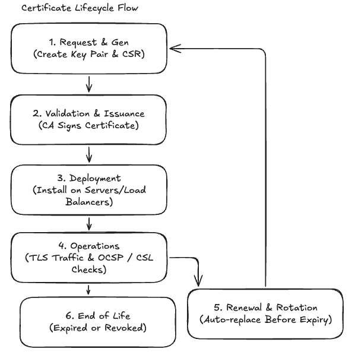
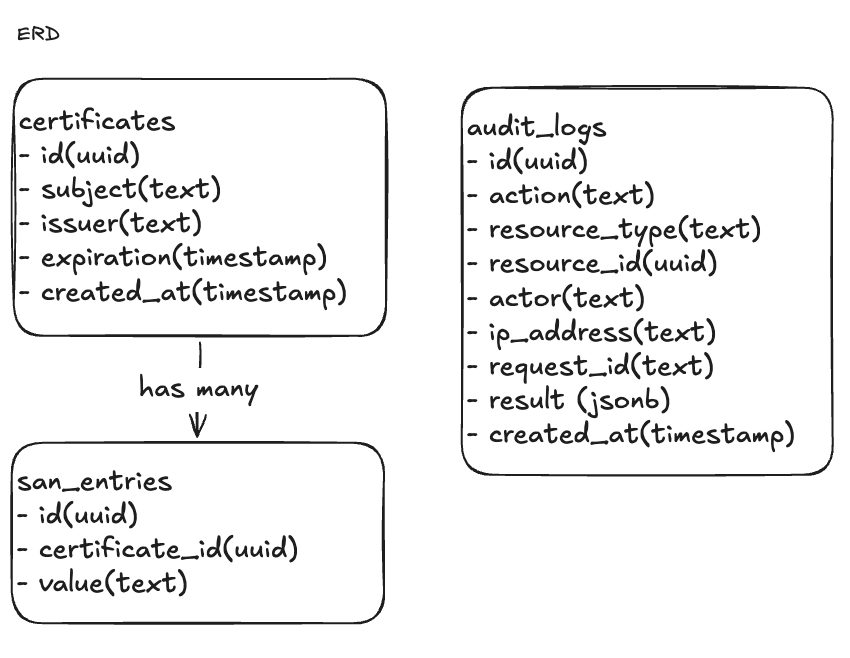
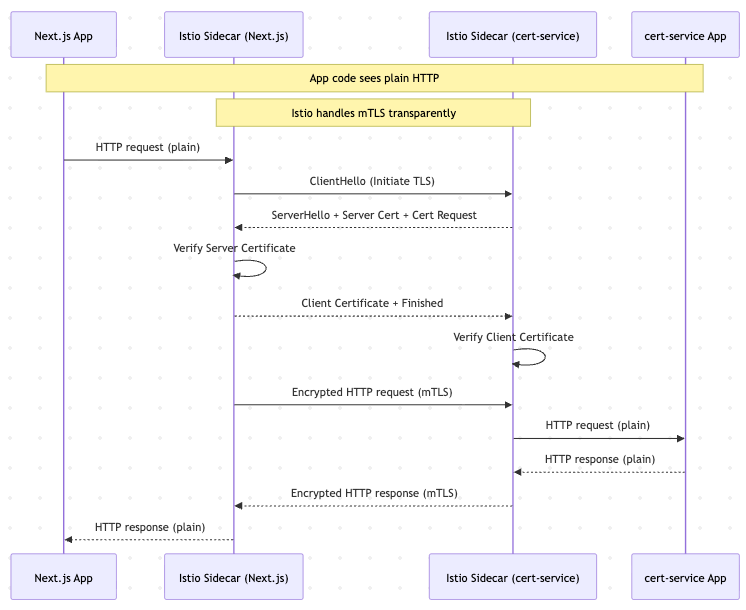
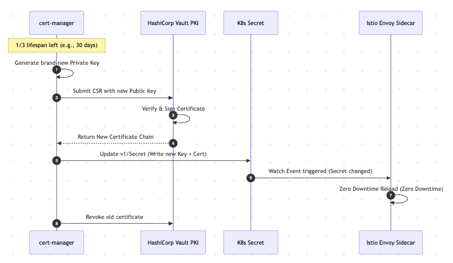

# Certificate Issuance and Inventory Microservice
## High-Level Design

## 1. Functional Requirements
## 2. Non-Functional Requirements
## 3. High-level Architecture
   - Rust microservice design
   - API design & certificate lifecycle flows
   - PostgreSQL schema & indexing strategy
   - Kubernetes components
   - Container image design & security
## 4. TLS/mTLS & Certificate Flow
   - How mTLS works in microservices
   - Certificate rotation
   - HSM/KMS for key storage
   - Certificate issuance workflow (CSR → signing → storage)
## 5. Next.js Integration
   - API consumption patterns
   - SSR vs CSR tradeoffs
   - Secure cookie/session/token management
## 6. Observability
   - Logging, metrics, tracing
   - Kubernetes probes
   - Rust performance tuning
## 7. Trade-offs & Design Decisions

---

## 1. Functional Requirements

1. Issue X.509 certificates (Dummy CA)
2. Store certificate metadata in PostgreSQL
3. Retrieve certificate metadata by ID
4. List certificates with pagination (keyset pagination)
5. Parse PEM files and auto-register certificate metadata
6. Expose secure API for Next.js frontend
7. Monitor certificate expiration (expiring within 30 days)
8. Provide audit logs for all certificate operations

---

## 2. Non-Functional Requirements

| Requirement | Approach |
|---|---|
| Security | TLS, mTLS (Istio), HSM/KMS for key storage |
| Scalability | Kubernetes HPA autoscaling |
| Availability | Health probes, graceful shutdown, multiple replicas |
| Observability | Structured logging, metrics, tracing, request ID, audit logs |
| Performance | Async Rust (Tokio), connection pooling, UUID v7 |
| Containerization | Multi-stage Docker, non-root user |

---

## 3. High-level Architecture

> 📊 **Diagram:** System architecture (Excalidraw)


> 📊 **Diagram:** Kubernetes Architecture


### 3.1 Rust Microservice Design
**Async Runtime:** Tokio

**Library Choices:**

| Library | Purpose |
|---|---|
| Axum | HTTP framework — ergonomic routing, Tower middleware |
| SQLx | Async PostgreSQL — compile-time query verification |
| Tokio | Async runtime |
| rcgen | X.509 certificate generation (Dummy CA) |
| x509-parser | PEM parsing and certificate metadata extraction |
| tracing | Structured logging |
| tower-http | Middleware (request ID, tracing) |
| thiserror | Error handling |

**Architecture Pattern:** Hexagonal Architecture (Ports & Adapters)

**API Boundaries:**

| Layer | Responsibility | Interface |
|---|---|---|
| HTTP Layer | Accept HTTP requests, return JSON responses | `CreateCertificateRequest`, `CertificateResponse` |
| Application Layer | Business logic, use cases | `CertificateService` trait |
| DB Layer | Certificate metadata persistence | `CertificatesRepository` trait |

> Each layer communicates only through defined traits.
> Outbound adapters (DB, CA) can be swapped without changing business logic.
> e.g. Replace DummyCaService with VaultCaService in production.

### 3.2 API Design & Certificate Lifecycle Flows

**OpenAPI / Swagger UI:**

> 🚧 Not implemented in this assessment.
> In production, would use `utoipa` crate to auto-generate OpenAPI documentation with Swagger UI at `/swagger-ui`.


**Endpoints:**

| Method | Path | Description |
|---|---|---|
| POST | /certificates | Issue or register a certificate (JSON or PEM) |
| GET | /certificates | List certificates with keyset pagination |
| GET | /certificates/:id | Get certificate by ID |
| GET | /health/live | Liveness probe |
| GET | /health/ready | Readiness probe |

> 📊 **Diagram:** Certificate Lifecycle Flow (Excalidraw)  


### 3.3 PostgreSQL Schema & Indexing Strategy

> 📊 **Diagram:** ERD (Excalidraw)


**Indexing Strategy:**

| Index | Reason |
|---|---|
| `idx_certificates_expiration` | Expiration monitoring queries |
| `idx_certificates_created_at` | Time-range queries |
| `idx_san_entries_certificate_id` | SAN lookup by certificate |
| `idx_audit_logs_resource_id` | Audit log queries by certificate |

> 🚧 Indexes are documented here but not added to the migration files in this assessment. In production, these indexes would be added via a separate migration.

**Key Design Decisions:**

| Decision | Reason |
|---|---|
| UUID v7 | Time-ordered, better B-tree index performance than UUID v4 |
| TIMESTAMPTZ | Timezone-aware — critical for certificate expiration |
| SAN as separate table | Normalized, enables individual SAN querying |
| JOIN + ARRAY_AGG | Avoids N+1 queries for SAN entries |
| Keyset pagination | More efficient than offset for large datasets |

#### Audit Log Storage Options

| Option | Description | Trade-off |
|---|---|---|
| PostgreSQL | Same DB as metadata | Simple, ACID, but adds load to main DB |
| Elasticsearch | Full-text search, analytics | Better for log search and dashboards |
| DynamoDB | AWS managed, high scale | High throughput, but vendor lock-in |
| Cassandra | Time-series, high write | Very high scale, complex ops |

> Audit logs are **append-only** and time-series in nature — NoSQL or dedicated log storage is often a better fit than relational DB in production.

**Recommended production approach:**
```
cert-service → Kafka → Elasticsearch (audit logs + search)
→ PostgreSQL (certificate metadata only)
```

#### Audit Log Implementation Strategy

| Option | Approach | Trade-off |
|---|---|---|
| Option A | Synchronous — same transaction | Guaranteed consistency, adds latency |
| Option B | Background — `tokio::spawn` | Non-blocking, may be lost on crash |
| Option C | Message Queue (Kafka) | High resilience, complex setup |

> In this assessment, audit logs are documented but not implemented.
> In production, Option A would be preferred for strict compliance, Option B for better performance.

### 3.4 Kubernetes Components

```
cert-service Namespace
  ├── Deployment (2 replicas)
  │     ├── Pod 1 (cert-service container)
  │     └── Pod 2 (cert-service container)
  ├── Service (ClusterIP)
  ├── ConfigMap
  ├── Secret
  └── HPA

nextjs Namespace
  ├── Deployment (2 replicas)
  │     ├── Pod 1 (nextjs container)
  │     └── Pod 2 (nextjs container)
  ├── Service (ClusterIP)
  └── ConfigMap

Ingress (TLS termination)
  ├── api.cert.com → cert-service
  └── app.cert.com → nextjs

External
  └── AWS RDS (PostgreSQL)
```

| Component | Description |
|---|---|
| Deployment | cert-service (min 2 replicas), Next.js |
| ConfigMap | Non-sensitive config (RUST_LOG, SERVER_PORT) |
| Secret | Sensitive config (DATABASE_URL, TLS_CERT, TLS_KEY) |
| Service | ClusterIP for internal routing |
| Ingress | TLS termination, external routing |
| HPA | Autoscaling based on CPU (70%) / Memory (80%) |
| Istio | Service mesh — automatic mTLS, sidecar injection |
| cert-manager | Automated certificate rotation |
| ArgoCD | GitOps — App of Apps pattern |

### 3.5 Container Image Design & Security

**Multi-stage build:**

| Stage | Base Image | Purpose |
|---|---|---|
| builder | rust:alpine | Compile binary with cargo-chef for layer caching |
| runtime | debian:bookworm-slim | Minimal runtime, no build tools |

**Why this works well:**
- Dependency compilation is cached separately from application source — faster CI/CD builds
- Runtime image does not include the Rust toolchain — smaller image, reduced attack surface
- `cargo-chef` improves layer caching when dependencies change less often than source files
- Same image can run locally, in CI, and in production

**Security considerations:**

| Concern | Implementation |
|---|---|
| Non-root user | `useradd --system --uid 10001 appuser` |
| Minimal attack surface | `debian:bookworm-slim` — only essential packages |
| No secrets in image | Injected via environment variables at runtime |
| Offline SQLx | `SQLX_OFFLINE=true` — no DB connection at build time |

> In production, add image vulnerability scanning in CI/CD pipeline.

---

## 4. TLS/mTLS & Certificate Flow

### 4.1 How mTLS Works in Microservices

**Regular TLS vs mTLS:**

| | TLS | mTLS |
|---|---|---|
| Server proves identity | ✅ | ✅ |
| Client proves identity | ❌ | ✅ |
| Use case | Browser → Server | Service → Service |

**In Kubernetes with Istio:**  



- App code communicates over plain HTTP internally
- Istio sidecar intercepts and wraps traffic with mTLS
- No application code changes required

**Implementation Options:**

| | Option A (Manual) | Option B (Istio) |
|---|---|---|
| Implementation | Per service | Automatic |
| Certificate management | Manual | Automatic |
| Rotation | Manual | Every 24h |
| Code changes | Required | None |

> I choose Option B (Istio) for production.

### 4.2 Certificate Rotation

> 📊 **Diagram:** Certificate Rotation Flow (Excalidraw)


- cert-manager monitors expiration (1/3 lifespan remaining)
- Generates new key pair
- Requests new certificate from Vault PKI
- Stores in Kubernetes Secret
- Istio injects new certificate (zero downtime)
- Revokes old certificate

> Rotation generates a completely new key pair — not a renewal of the existing key.

### 4.3 HSM/KMS for Key Storage

| Option | Description | Use Case |
|---|---|---|
| AWS KMS | Cloud-managed key service | Most production systems |
| HashiCorp Vault | Self-hosted secrets management | Multi-cloud, high security |
| HSM | Physical hardware device | Banks, government |
| Local file | Stored on disk | Development only |

> Private Keys must never be stored in plaintext or in a database.
> In this assessment: local files. In production: AWS KMS or HashiCorp Vault.

**How to integrate HSM/KMS for key storage: **
```
cert-manager
↓ Generates CSR
↓ Sends to Vault PKI
Vault PKI
↓ Uses AWS KMS as signing backend
↓ Private Key never leaves KMS boundary
↓ Returns signed certificate
cert-manager
↓ Stores certificate in Kubernetes Secret
↓ Istio injects into pods
```

> cert-manager handles the interaction with Vault PKI, which uses AWS KMS as its signing backend.
> cert-manager requires a `ClusterIssuer` configuration pointing to Vault PKI.

### 4.4 Certificate Issuance Workflow (CSR → Signing → Storage)

**In This Assessment (Dummy CA):**
```
Client
↓ POST /certificates (JSON or PEM)
cert-service
↓ Parse & validate
↓ Dummy CA (rcgen) → generate X.509 certificate
↓ Store metadata in PostgreSQL
↓ Return certificate (PEM) + metadata
```

**In Production (Real PKI):**

Scenario A — Manual (User/External App Request)
```
Client (User/Server)
↓ Generate key pair INSIDE KMS/HSM & Create CSR
↓ POST /certificates (CSR)
cert-service
↓ Send CSR to HashiCorp Vault PKI
↓ Vault signs the certificate
↓ Store metadata in PostgreSQL & Return signed certificate
```

Scenario B — Automated (Internal Mesh Infrastructure)
```
cert-manager
↓ Generate key pair locally inside K8s & Create CSR
↓ Submit CSR to Vault PKI (via ClusterIssuer)
Vault PKI
↓ Sign certificate & Return to cert-manager
cert-manager
↓ Store in Kubernetes Secret
↓ Istio Envoy hot-reloads it (Zero Downtime)
```

---

## 5. Next.js Integration

### 5.1 API Consumption Patterns

**SSR + SWR Hybrid Pattern:**

```
Browser
↓ Request /inventory
Next.js Server
↓ fetch https://cert-service/certificates (SSR)
↓ Render HTML with initial data
↓ Return complete HTML to browser
Browser
↓ Hydration (React attaches to HTML)
↓ SWR activates → fetch /api/certificates (API Route proxy)
↓ Background revalidation
```

**Why this pattern:**
- SSR → fast initial load, SEO friendly
- SWR → keeps data fresh without full page reload
- API Route proxy → avoids self-signed cert issues in browser

### 5.2 SSR vs CSR Tradeoffs

| | SSR | CSR |
|---|---|---|
| Initial load | Fast (HTML ready) | Slow (blank screen) |
| SEO | Good | Poor |
| Data freshness | On request | SWR auto-revalidates |
| Sensitive data | Safe (server-side) | Exposed to browser |
| Use case | /inventory page | Real-time updates |

### 5.3 Secure Cookie/Session/Token Management

**In This Assessment:**
- No authentication implemented
- Service-to-service authentication handled by mTLS (Istio)

**In Production:**

| Concern | Recommendation |
|---|---|
| Authentication | JWT or session-based auth |
| Token storage | HttpOnly cookies (not localStorage) |
| CSRF protection | SameSite cookie attribute |
| Session management | Short-lived JWTs + Refresh Token in DB |
| Service-to-service | mTLS via Istio (no tokens needed) |

**Why HttpOnly cookies over localStorage:**
- localStorage is accessible via JavaScript → vulnerable to XSS
- HttpOnly cookies cannot be read by JavaScript → XSS safe
- Add `SameSite=Strict` for CSRF protection
- Add `Secure` flag for HTTPS-only transmission

**JWT Flow in Production:**
```
Login
↓ Issue Access Token (15min) + Refresh Token (30days)
↓ Store both in HttpOnly cookies
Access Token expires
↓ POST /auth/refresh (Refresh Token)
↓ Verify Refresh Token in DB
↓ Issue new Access Token
Logout
↓ Delete Refresh Token from DB (immediate revocation)
```

> Internal service-to-service communication is secured by mTLS via Istio.
> JWT tokens are only needed for human users accessing the Next.js frontend.

---

## 6. Observability

### 6.1 Logging, Metrics, Tracing

**Logging (In This Assessment):**
- Structured logging with `tracing` crate
- Log levels: `info` (app), `debug` (tower_http), `warn` (sqlx)
- Every request tagged with `x-request-id` for correlation

| Target | Level | Reason |
|---|---|---|
| Application | info | General operational logs |
| tower_http | debug | Request/response logs |
| sqlx | warn | Avoid excessive query logs |

**Request ID Correlation:**
```
INFO request{method=POST uri=/certificates request_id=019e2d0b-...}: started
INFO request{method=POST uri=/certificates request_id=019e2d0b-...}: finished latency=56ms status=201
```

**Metrics (In Production):**
- Prometheus scrapes `/metrics` endpoint
- Grafana dashboards + alerting

| Metric | Description |
|---|---|
| `http_requests_total` | Total requests by method, path, status |
| `http_request_duration_seconds` | Request latency histogram |
| `certificates_total` | Total certificates issued |
| `certificates_expiring_soon` | Certificates expiring within 30 days |
| `db_pool_connections` | Connection pool usage |

**Tracing (In Production):**
- OpenTelemetry + Jaeger for distributed tracing
- Trace propagated across Next.js → cert-service → PostgreSQL
- Answers: which service is slow? where did the request fail?

**Production Observability Stack Options:**

| | Grafana Stack | Datadog |
|---|---|---|
| Cost | Free (OSS) | High |
| Operations | Self-managed | Fully managed |
| Vendor lock-in | None | Yes |
| Setup complexity | High | Low |
| Use case | Scale, multi-cloud | Startup, fast setup |

> Start with Datadog for speed.
> Migrate to Grafana Stack (Loki + Tempo + Prometheus) as scale grows.

### 6.2 Kubernetes Probes

**Implemented in This Assessment:**

| Probe | Endpoint | Question | Action on failure |
|---|---|---|---|
| Liveness | /health/live | Is the service alive? | Restart container |
| Readiness | /health/ready | Is DB connected? | Remove from load balancer |

### 6.3 Rust Performance Tuning

| Technique | Description |
|---|---|
| Async runtime (Tokio) | Non-blocking I/O, handles thousands of concurrent connections |
| Connection pooling (SQLx) | Reuse DB connections, avoid connection overhead |
| UUID v7 | Time-ordered IDs reduce B-tree page splits |
| JOIN + ARRAY_AGG | Single query instead of N+1 queries for SAN entries |
| `--release` build | Optimized binary, removes debug symbols |
| `cargo-chef` | Docker layer caching for faster CI/CD builds |

---

## 7. Trade-offs & Design Decisions

| Decision | Chosen | Alternative | Reason |
|---|---|---|---|
| Architecture | Hexagonal (Ports & Adapters) | Layered | Clear separation of inbound/outbound adapters, easy to swap implementations |
| Pagination | Keyset | Offset | Better performance at scale, no duplicate/missing records |
| ID type | UUID v7 | UUID v4 / auto-increment | Time-ordered, better B-tree index performance |
| SAN storage | Separate table | PostgreSQL array | Normalized, enables individual SAN querying |
| mTLS | Istio (documented) | Manual implementation | Automatic rotation, no code changes, sidecar pattern |
| TLS termination | Ingress | App-level | Industry standard, separation of concerns |
| Frontend rendering | SSR + SWR | CSR only | Fast initial render + fresh data |
| Key storage | KMS/HSM (documented) | Local file | Private Keys never in plaintext |
| DB deployment | AWS RDS | StatefulSet | Managed service, automatic backups, no operational overhead |
| Deployment | ArgoCD App of Apps | kubectl apply | GitOps, declarative, easy rollback |
| Audit log storage | Elasticsearch (documented) | PostgreSQL | Append-only, time-series nature suits NoSQL |
| Observability | Datadog → Grafana Stack | Single tool | Start fast, migrate as scale grows |
