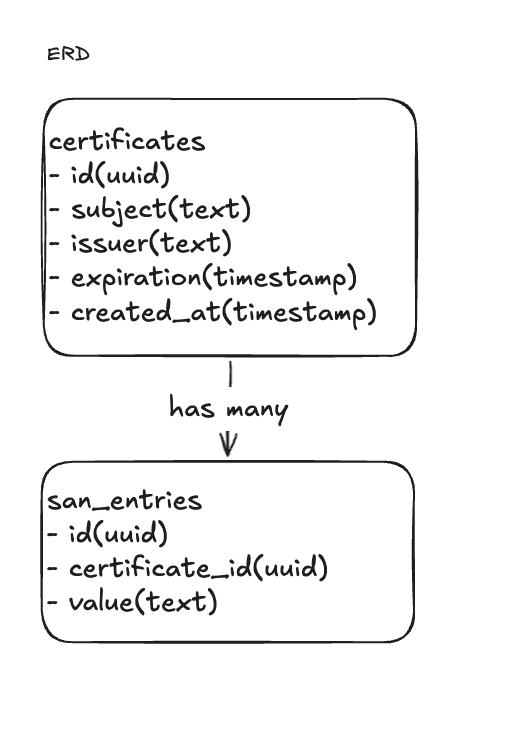
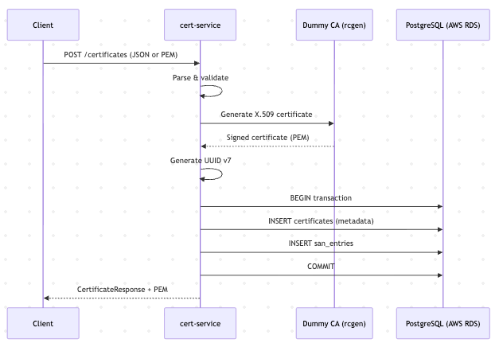
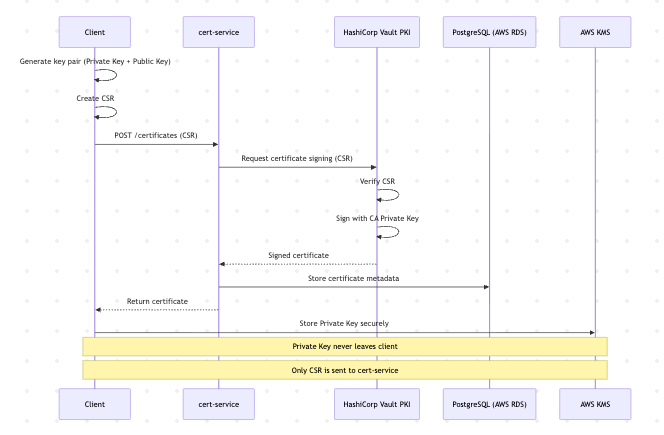
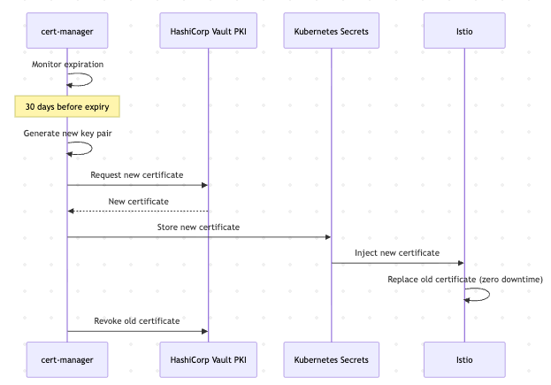
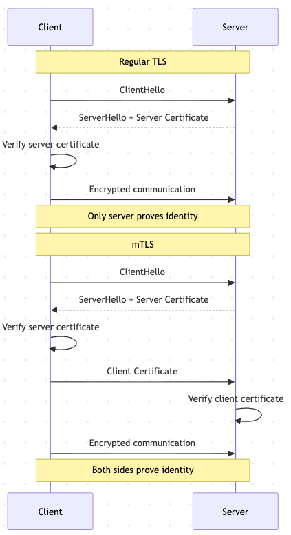
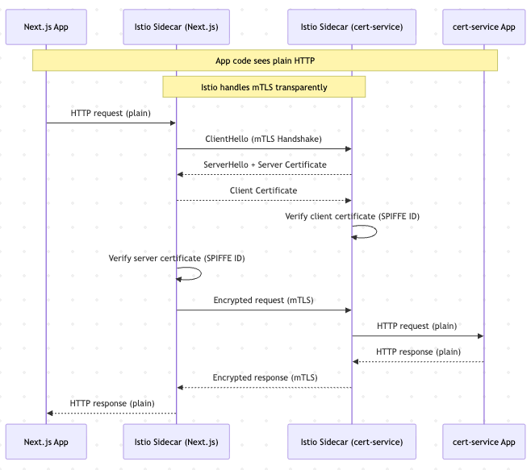
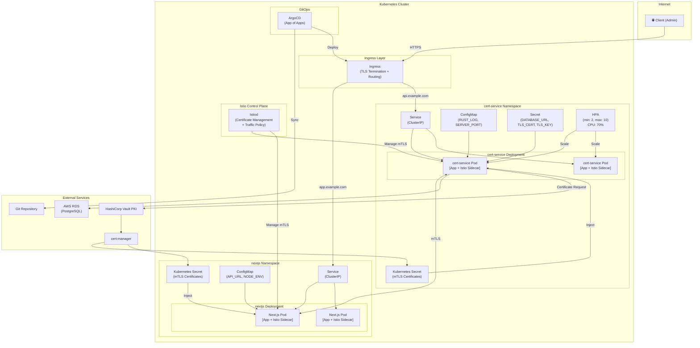
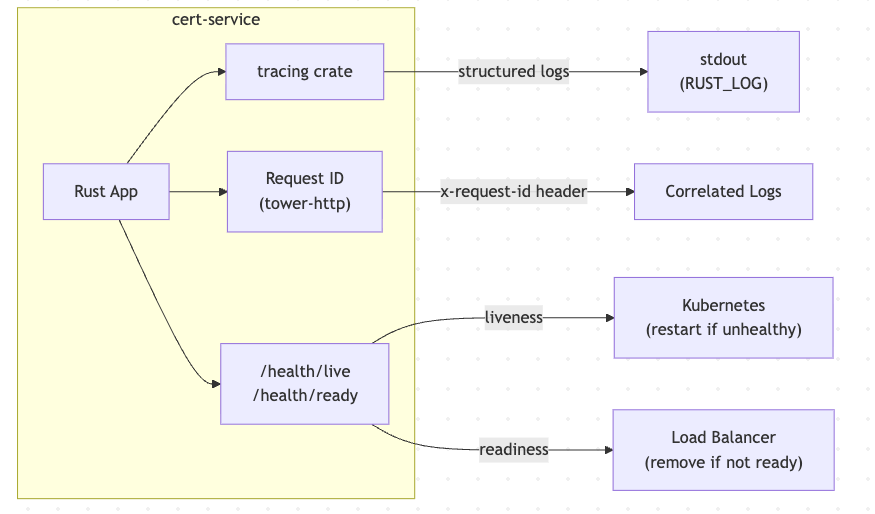
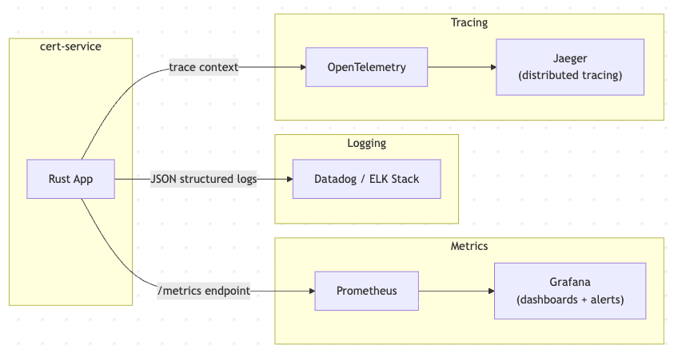

# Certificate Issuance and Inventory Microservice

## System Design

---

## 1. Overview

A secure, cloud-native microservice for issuing and managing X.509 certificates. Built with Rust for performance and safety, deployed on Kubernetes, and consumed by a Next.js frontend.

### TechStack

| Layer | Technology | Reason |
|---|---|---|
| Backend | Rust (Axum) | Performance, memory safety, async |
| Database | PostgreSQL | Reliable, ACID compliant |
| Frontend | Next.js | SSR, TypeScript |
| Container | Docker | Reproducible builds |
| Orchestration | Kubernetes | Scalability, reliability |
| Service Mesh | Istio | mTLS, observability |
| GitOps | ArgoCD | Declarative deployments |

## 2. Functional Requirements

1. Issue X.509 certificates (Dummy CA)
2. Store certificate metadata in PostgreSQL
3. Retrieve certificate metadata by ID
4. List certificates with pagination
5. Parse PEM files and auto-register certificate metadata
6. Expose secure API for Next.js frontend consumption
  - `POST /certificates`
  - `GET /certificates`
  - `GET /certificates/{id}`
7. Monitor certificate expiration (expiring within 30 days)

---

## 3. Non-Functional Requirements

1. Security - TLS, mTLS, HSM/KMS for key storage
2. Scalability - Kubernetes HPA autoscaling
3. Availability - Health probes, graceful shutdown
4. Observability - Structured logging, metrics, tracing, request ID
5. Performance - Async Rust (Tokio), connection pooling
6. Containerization - Multi-stage Docker, non-root user
7. API Security - TLS encryption, CORS, Next.js SSR support

## 4. High-level Architecture

> System overview

TODO: @@ Excalidraw 

### System Componenets

TODO:@@ Excalidraw

### Component REsponsibilities
| Component | Responsibility |
|---|---|
| Ingress | TLS termination, routing, load balancing |
| Next.js | SSR, client-side data fetching (SWR) |
| cert-service | Certificate issuance, metadata storage, API |
| PostgreSQL | Certificate metadata persistence |
| Istio | mTLS, service mesh, observability |
| ArgoCD | GitOps-based deployment management |

### Rust Microservice Design

**Async Runtime:** Tokio

**Library Choices:**

| Library | Purpose |
|---|---|
| Axum | HTTP framework |
| SQLx | Async PostgreSQL client with compile-time query checks |
| x509-parser | X.509 certificate parsing |
| tracing | Structured logging |
| tower-http | Middleware (tracing, request ID) |
| async-trait | Async trait support |

**Module Structure:**
> 🚧 To be updated after Clean Architecture refactoring.

**API Boundaries:**
```

HTTP Request
↓
Router (routes/)
↓
Handler (handlers/)
↓
Service (service.rs)
↓
Repository (repository.rs)
↓
PostgreSQL
```

## 5. API Design

## API Documentation

### OpenAPI / Swagger UI

> 🚧 Not implemented in this assessment.
> 
> In production, we would use `utoipa` crate to generate OpenAPI documentation:
> - Auto-generated from handler annotations
> - Swagger UI at `/swagger-ui`
> - ReDoc at `/redoc`
>
> ```bash
> cargo add utoipa --features axum
> cargo add utoipa-swagger-ui --features axum
> ```

### Endpoints

| Method | Path | Description |
|---|---|---|
| POST | /certificates | Issue/register a certificate |
| GET | /certificates | List certificates (keyset pagination) |
| GET | /certificates/:id | Get certificate by ID |
| GET | /health/live | Liveness probe |
| GET | /health/ready | Readiness probe |

### POST /certificates

Supports two options:

** Option A — Manual JSON:**
```json
{
  "subject": "example.com",
  "issuer": "MyRootCA",
  "expiration": "2026-01-01T00:00:00Z",
  "san_entries": ["www.example.com", "api.example.com"]
}
```

** Option B — PEM Parsing:**
```json
{
  "pem": "-----BEGIN CERTIFICATE-----\n..."
}
```

**Response (201 Created):**
```json
{
  "id": "019e2d0b-...",
  "subject": "example.com",
  "issuer": "MyRootCA",
  "expiration": "2026-01-01T00:00:00Z",
  "san_entries": ["www.example.com"],
  "created_at": "2026-05-15T19:09:24Z"
}
```

### GET /certificates

**Query Parameters:**
| Parameter | Type | Description |
|---|---|---|
| cursor | UUID | Keyset pagination cursor |
| limit | integer | Page size (default: 10, max: 100) |

**Response (200 OK):**
```json
{
  "data": [...],
  "next_cursor": "019e2d0b-...",
  "has_more": true,
  "total": 100,
  "expiring_soon_count": 5
}
```

## 6. PostgreSQL Schema & Indexing

> 📊 **Diagram:** ERD (Excalidraw)


### Tables

#### certificates
```sql
CREATE TABLE certificates (
    id UUID PRIMARY KEY,
    subject TEXT NOT NULL,
    issuer TEXT NOT NULL,
    expiration TIMESTAMPTZ NOT NULL,
    created_at TIMESTAMPTZ NOT NULL DEFAULT NOW()
);
```

#### san_entries
```sql
CREATE TABLE san_entries (
    id UUID PRIMARY KEY,
    certificate_id UUID NOT NULL REFERENCES certificates(id) ON DELETE CASCADE,
    value TEXT NOT NULL
);
```

### Design Decisions

| Decision | Reason |
|---|---|
| UUID v7 as Primary Key | Time-ordered, better B-tree index performance than UUID v4 |
| TIMESTAMPTZ | Timezone-aware timestamps — critical for certificate expiration |
| SAN as separate table | Normalized structure, enables individual SAN querying |
| ON DELETE CASCADE | Removing a certificate automatically removes its SAN entries |


### Indexing Strategy

```sql
-- Keyset pagination (already ordered by UUID v7)
-- UUID v7 is time-ordered so no additional index needed for created_at ordering

-- Expiration monitoring
CREATE INDEX idx_certificates_expiration ON certificates(expiration);

-- Time-range queries on created_at
CREATE INDEX idx_certificates_created_at ON certificates(created_at);

-- SAN lookup by certificate
CREATE INDEX idx_san_entries_certificate_id ON san_entries(certificate_id);
```

### Query Patterns

**Keyset Pagination:**
```sql
SELECT 
    c.id, c.subject, c.issuer, c.expiration, c.created_at,
    ARRAY_AGG(s.value) FILTER (WHERE s.value IS NOT NULL) as san_entries
FROM certificates c
LEFT JOIN san_entries s ON s.certificate_id = c.id
WHERE ($1::uuid IS NULL OR c.id > $1)
GROUP BY c.id
ORDER BY c.id ASC
LIMIT $2;
```

**Expiring Soon Count:**
```sql
SELECT COUNT(*) FROM certificates
WHERE expiration > NOW()
AND expiration <= NOW() + INTERVAL '30 days';
```

### Time-range Query Options

**Option A — Using `created_at` index (simpler, recommended):**
```sql
SELECT * FROM certificates
WHERE created_at BETWEEN '2026-01-01' AND '2026-06-01';
```

**Option B — Using UUID v7 range (no additional index needed):**

Since UUID v7 embeds a millisecond timestamp in the first 48 bits, time-range queries can be performed using the primary key:

```sql
-- Calculate UUID v7 boundaries for a time range
-- min_uuid_v7: timestamp bits set to start time, random bits = 0x000...
-- max_uuid_v7: timestamp bits set to end time, random bits = 0xFFF...
SELECT * FROM certificates
WHERE id BETWEEN $min_uuid_v7 AND $max_uuid_v7;
```

**Tradeoff:**

| | `created_at` index | UUID v7 range |
|---|---|---|
| Implementation | Simple | Complex |
| Additional index | Required | Not needed |
| Readability | High | Low |
| Precision | Microsecond | Millisecond |

> We use `created_at` index for simplicity and readability. UUID v7 range queries are an optimization worth considering if storage is a concern.

### Why UUID v7 over UUID v4?

| | UUID v4 | UUID v7 |
|---|---|---|
| Structure | Fully random | Timestamp + random |
| Sortable | No | Yes (time-ordered) |
| Index performance | Poor (random inserts cause page splits) | Good (sequential inserts) |
| Use case | General purpose | Time-ordered records |

> UUID v7 is particularly well-suited for certificate management since certificates are naturally time-ordered and frequently queried by creation time.

---

## 7. Certificate Lifecycle & Flow

> 📊 **Diagram:** Certificate lifecycle flow (Excalidraw)
#### In This Assessment (Dummy CA)
> 🚧 Diagram to be updated after rcgen Dummy CA implementation.


#### In Production (Real PKI)


#### Certificate Rotation


### Overview
```
Issuance → Active → Rotation → Revocation/Expiration
```

### 7.1 Certificate Issuance Workflow

**Real-world flow (CSR → Signing → Storage):**

```
Client
↓ Generate key pair (Private Key + Public Key)
↓ Create CSR (Public Key + identity info)
↓ Send CSR to CA
CA
↓ Verify CSR
↓ Sign with CA's Private Key
↓ Issue certificate
Client
↓ Store Private Key securely (KMS/HSM)
↓ Store certificate
```

> The Private Key never leaves the client. Only the CSR is sent to the CA.

**In this assessment (Dummy CA):**

```

Client
↓ POST /certificates (JSON metadata or PEM)
cert-service
↓ Parse & validate
↓ Generate UUID v7
↓ Insert into PostgreSQL (transaction)
├── certificates table
└── san_entries table
↓ Return CertificateResponse
```

> In production, we would integrate with a real CA (e.g., HashiCorp Vault PKI, AWS ACM, or an internal CA). The client would generate a key pair locally, send only the CSR, and store the Private Key in KMS or HSM.

### 7.2 Active Stage

- Certificate is within its validity period (`Not Before` → `Not After`)
- Used for TLS handshakes, mTLS, identity verification
- Metadata stored in PostgreSQL
- `expiring_soon_count` tracks certificates expiring within 30 days
- Dashboard displays expiration status

### 7.3 Certificate Rotation

Replacing an expiring certificate with a new one before it expires.

**Why automation is essential:**
- Expired certificates cause service outages
- Manual rotation is error-prone at scale
- Microservice environments may have hundreds of certificates

**Rotation strategies:**

| Strategy | Description |
|---|---|
| Short-lived certificates | Issue with short TTL (e.g., 24h) and auto-renew |
| cert-manager | Kubernetes tool that automates certificate rotation |
| ACME Protocol | Automated renewal protocol used by Let's Encrypt |
| Istio | Automatically rotates mTLS certificates for service mesh |

**Production rotation flow:**

```
cert-manager monitors expiration
↓ 30 days before expiry → generate new key pair
↓ Create new CSR
↓ Request new certificate from CA
↓ Store new certificate in Kubernetes Secret
↓ Replace old certificate with zero downtime
↓ Revoke old certificate
```

> Rotation generates a completely new key pair — it is not a renewal of the existing key. The new Private Key is managed by cert-manager and stored in Kubernetes Secrets, ideally encrypted with KMS.

### 7.4 Revocation

Invalidating a certificate before its expiration date.

**When to revoke:**
- Private Key compromised
- Certificate issued incorrectly
- Service decommissioned

**Revocation mechanisms:**

| Mechanism | Description |
|---|---|
| CRL (Certificate Revocation List) | A list of revoked certificates published by the CA |
| OCSP (Online Certificate Status Protocol) | Real-time revocation status check |

### 7.5 Key Storage

Private Keys must be stored securely throughout the lifecycle.

| Option | Description | Use Case |
|---|---|---|
| HSM | Physical hardware device | Highest security (banks, government) |
| KMS | Cloud-managed key service (AWS KMS, GCP KMS) | Most production systems |
| Kubernetes Secret + KMS encryption | cert-manager managed | Kubernetes-native workloads |
| Local file | Stored on disk | Development only — never in production |

> Private Keys must never be stored in plaintext or in a database. Always use KMS or HSM in production.

---

## 8. TLS/mTLS & Certificate Flow

> 📊 **Diagram:** mTLS flow (Excalidraw)

### 8.1 TLS vs mTLS

#### Regular TLS vs mTLS Flow


**Regular TLS:**

```
Client                 Server
↓ ClientHello
↓ ServerHello + Certificate
↓ Verify server certificate
↓ Encrypted communication
```

Only the server proves its identity. The client is anonymous.

**mTLS (Mutual TLS):**

```
Client                 Server
↓ ClientHello
↓ ServerHello + Certificate
↓ Verify server certificate
↓ Client Certificate
↓ Verify client certificate
↓ Encrypted communication
```

Both sides prove their identity before any data is exchanged.

### 8.2 Why mTLS in Microservices

In a Kubernetes cluster, services communicate with each other internally. Without mTLS:
- Any service inside the cluster can call any other service
- No way to verify "is this really service A calling me?"

With mTLS:
- Only trusted services with valid certificates can communicate
- Zero-trust networking inside the cluster

> Even inside a private cluster, mTLS ensures that only authorized services can talk to each other.

### 8.3 mTLS Implementation Options

#### Option A — Manual Implementation (without Service Mesh)

Each service handles mTLS directly in application code.

**Rust server (cert-service):**
```rust
let config = rustls::ServerConfig::builder()
    .with_client_cert_verifier(verifier) // require client certificate
    .with_single_cert(cert, key)?;
```

**Next.js client:**
```typescript
const agent = new https.Agent({
  cert: fs.readFileSync('client.crt'),
  key: fs.readFileSync('client.key'),
  ca: fs.readFileSync('ca.crt'),
});
```

**Cons:**
- Every service must implement mTLS manually
- Certificate management is manual
- Certificate rotation must be implemented per service
- Complexity grows with number of services

---

#### Option B — Istio Service Mesh (recommended for production)

Istio injects a sidecar proxy into each pod that transparently handles all mTLS operations.

```
[cert-service App]     [Next.js App]
↕                      ↕
[Istio Sidecar]  ←mTLS→  [Istio Sidecar]
```

- Application code communicates over plain HTTP internally
- Sidecar intercepts traffic and wraps it with mTLS
- Application has no knowledge of mTLS

**Istio PeerAuthentication policy:**
```yaml
apiVersion: security.istio.io/v1beta1
kind: PeerAuthentication
metadata:
  name: default
  namespace: cert-service
spec:
  mtls:
    mode: STRICT
```

**What Istio handles automatically:**
- Certificate issuance per pod
- Certificate rotation (every 24 hours)
- mTLS enforcement across all services
- Workload identity via SPIFFE/SPIRE

| | Option A (Manual) | Option B (Istio) |
|---|---|---|
| Implementation | Per service | Automatic |
| Certificate management | Manual | Automatic |
| Rotation | Manual | Automatic (24h) |
| Code changes | Required | None |
| Complexity | High | Low |

> **We recommend Option B for production.** Option A is only viable for very small systems with few services.

#### Istio mTLS flow


#### In This Assessment

mTLS is documented here. In a real Kubernetes deployment, we would use Istio with `STRICT` mode to enforce mTLS for all internal service-to-service communication.

### 8.4 Certificate Rotation in mTLS

Istio handles certificate rotation automatically:
- Default certificate TTL: 24 hours
- Istio rotates certificates before expiry
- No service downtime during rotation
- Uses SPIFFE/SPIRE for workload identity

### 8.5 HSM/KMS Integration

In production, private keys must never exist in plaintext.

**Integration options:**

| Option | Description |
|---|---|
| AWS KMS | Cloud-managed key storage, integrates with cert-manager |
| HashiCorp Vault | Self-hosted secrets management with PKI engine |
| AWS ACM (Private CA) | Fully managed private CA with automatic rotation |
| Google Cloud KMS | GCP-native key management |

**cert-manager + AWS KMS flow:**

```
cert-manager
↓ Generate new key pair
↓ Store Private Key in AWS KMS
↓ CSR signed by CA
↓ Certificate stored in Kubernetes Secret
↓ Private Key operations performed inside KMS (never exported)
```

> The Private Key never leaves KMS. All signing operations are performed inside the KMS boundary.

### 8.6 In This Assessment

| Concern | Implementation |
|---|---|
| TLS | Self-signed certificate with axum-server + rustls |
| mTLS | Documented — would use Istio in production |
| Key Storage | Local file (certs/) — would use KMS in production |
| Certificate Rotation | Documented — would use cert-manager in production |

**TLS setup:**
```bash
# Generate self-signed certificate
openssl req -x509 -newkey rsa:4096 \
  -keyout certs/key.pem \
  -out certs/cert.pem \
  -days 365 -nodes \
  -subj "/CN=localhost"
```

> In production, TLS termination would be handled at the Ingress level. Application-level TLS is demonstrated here to show the concept.

---

## 9. Kubernetes Components

<!-- TODO: @@ -->
> 📊 **Diagram:** Kubernetes architecture (Excalidraw)



### 9.1 Overview
```
Internet
                    ↓
               Ingress (TLS)
                    ↓
      ┌─────────────────────────┐
      │                         │
 Next.js Service         cert-service
 (Deployment)            (Deployment)
                                │
                          PostgreSQL
                          (Managed DB)
```

### 9.2 Namespace

```yaml
apiVersion: v1
kind: Namespace
metadata:
  name: cert-service
  labels:
    istio-injection: enabled  # Auto-inject Istio sidecar
```

### 9.3 ConfigMap

Non-sensitive configuration:

```yaml
apiVersion: v1
kind: ConfigMap
metadata:
  name: cert-service-config
  namespace: cert-service
data:
  RUST_LOG: "info,tower_http=debug,sqlx=warn"
  SERVER_PORT: "3000"
```

### 9.4 Secret

Sensitive configuration:

```yaml
apiVersion: v1
kind: Secret
metadata:
  name: cert-service-secret
  namespace: cert-service
type: Opaque
data:
  DATABASE_URL: <base64-encoded>
  TLS_CERT: <base64-encoded>
  TLS_KEY: <base64-encoded>
```

> In production, Secrets should be encrypted at rest using KMS (e.g., AWS KMS with Kubernetes envelope encryption) or managed by HashiCorp Vault.

### 9.5 Deployment

```yaml
apiVersion: apps/v1
kind: Deployment
metadata:
  name: cert-service
  namespace: cert-service
spec:
  replicas: 2
  selector:
    matchLabels:
      app: cert-service
  template:
    metadata:
      labels:
        app: cert-service
    spec:
      securityContext:
        runAsNonRoot: true
        runAsUser: 10001      # non-root user (matches Dockerfile)
      containers:
        - name: cert-service
          image: cert-service:latest
          ports:
            - containerPort: 3000
          envFrom:
            - configMapRef:
                name: cert-service-config
            - secretRef:
                name: cert-service-secret
          livenessProbe:
            httpGet:
              path: /health/live
              port: 3000
              scheme: HTTPS
            initialDelaySeconds: 10
            periodSeconds: 10
          readinessProbe:
            httpGet:
              path: /health/ready
              port: 3000
              scheme: HTTPS
            initialDelaySeconds: 5
            periodSeconds: 5
          resources:
            requests:
              cpu: 100m
              memory: 128Mi
            limits:
              cpu: 500m
              memory: 256Mi
```

### 9.6 Service

```yaml
apiVersion: v1
kind: Service
metadata:
  name: cert-service
  namespace: cert-service
spec:
  selector:
    app: cert-service
  ports:
    - port: 3000
      targetPort: 3000
```

### 9.7 Ingress

```yaml
apiVersion: networking.k8s.io/v1
kind: Ingress
metadata:
  name: cert-service-ingress
  namespace: cert-service
  annotations:
    nginx.ingress.kubernetes.io/ssl-redirect: "true"
spec:
  tls:
    - hosts:
        - api.example.com
        - app.example.com
      secretName: tls-secret
  rules:
    - host: api.example.com
      http:
        paths:
          - path: /
            pathType: Prefix
            backend:
              service:
                name: cert-service
                port:
                  number: 3000
    - host: app.example.com
      http:
        paths:
          - path: /
            pathType: Prefix
            backend:
              service:
                name: nextjs-service
                port:
                  number: 3001
```

### 9.8 HPA (Horizontal Pod Autoscaler)

```yaml
apiVersion: autoscaling/v2
kind: HorizontalPodAutoscaler
metadata:
  name: cert-service-hpa
  namespace: cert-service
spec:
  scaleTargetRef:
    apiVersion: apps/v1
    kind: Deployment
    name: cert-service
  minReplicas: 2
  maxReplicas: 10
  metrics:
    - type: Resource
      resource:
        name: cpu
        target:
          type: Utilization
          averageUtilization: 70
    - type: Resource
      resource:
        name: memory
        target:
          type: Utilization
          averageUtilization: 80
```

### 9.9 Container Image Design & Security

**Multi-stage build:**
```
Stage 1 (builder): rust:alpine
→ cargo-chef for dependency caching
→ cargo build --release
→ SQLX_OFFLINE=true
Stage 2 (runtime): debian:bookworm-slim
→ Copy binary only
→ Non-root user (uid: 10001)
→ Minimal packages
```

**Security considerations:**
- Non-root user in container
- Read-only filesystem where possible
- No unnecessary packages in runtime image
- Secrets injected via environment variables, not baked into image
- Image vulnerability scanning in CI/CD pipeline

### 9.10 GitOps with ArgoCD (App of Apps Pattern)
```
ArgoCD Root App
├── cert-service App
│     ├── Deployment
│     ├── Service
│     ├── ConfigMap
│     └── Secret
├── nextjs App
│     ├── Deployment
│     └── Service
└── Istio App
└── PeerAuthentication
```

**Benefits:**
- Git as single source of truth
- Automated deployment on git push
- Easy rollback to any previous state
- Environment-specific configurations (dev/staging/prod)

> In production, we would use ArgoCD with the App of Apps pattern for GitOps-based deployment management.

---

## 10. Observability

<!-- TODO: @@ -->
> 📊 **Diagram:** Observability stack (Excalidraw)

### 10.1 Three Pillars

| Pillar | In This Assessment | In Production |
|---|---|---|
| Logging | tracing + tracing-subscriber | ELK Stack, Datadog |
| Metrics | Not implemented | Prometheus + Grafana |
| Tracing | Request ID (tower-http) | OpenTelemetry + Jaeger |

---

### 10.2 In This Assessment

#### Structured Logging

```rust
tracing_subscriber::registry()
    .with(EnvFilter::try_from_default_env()
        .unwrap_or_else(|_| "info,tower_http=debug,sqlx=warn".into()))
    .with(tracing_subscriber::fmt::layer())
    .init();
```


**Log levels:**

| Target | Level | Reason |
|---|---|---|
| Application | info | General operational logs |
| tower_http | debug | Request/response logs |
| sqlx | warn | Avoid excessive query logs |

#### Request ID

Every request gets a unique `x-request-id` for log correlation:
```
INFO request{method=POST uri=/certificates request_id=019e2d0b-...}: started processing request
INFO request{method=POST uri=/certificates request_id=019e2d0b-...}: finished processing request latency=56ms status=201
```

#### Health Probes

```
GET /health/live  → Liveness  (is the service alive?)
GET /health/ready → Readiness (is the DB connected?)
```

| Probe | Question | Action on failure |
|---|---|---|
| Liveness | Is the process healthy? | Restart container |
| Readiness | Can it handle traffic? | Remove from load balancer |

#### Observability Flow


---

### 10.3 In Production

#### Metrics (Prometheus + Grafana)

Key metrics to track:

| Metric | Description |
|---|---|
| `http_requests_total` | Total requests by method, path, status |
| `http_request_duration_seconds` | Request latency histogram |
| `certificates_total` | Total certificates issued |
| `certificates_expiring_soon` | Certificates expiring within 30 days |
| `db_pool_connections` | Connection pool usage |

#### Distributed Tracing (OpenTelemetry + Jaeger)

```

Browser → Next.js → cert-service → PostgreSQL
└── trace_id propagated across all services
```

Allows answering:
- Which service is slow?
- Where did the request fail?
- What is the latency breakdown per service?

#### Log Aggregation

- JSON structured logging for machine-readable logs
- Centralized log aggregation (ELK Stack or Datadog)
- Log correlation via `x-request-id` across services

#### Production Observability Stack

---

### 10.4 Rust Performance Tuning

| Technique | Description |
|---|---|
| Async runtime (Tokio) | Non-blocking I/O, handles thousands of concurrent connections |
| Connection pooling (SQLx) | Reuse DB connections, avoid connection overhead |
| UUID v7 | Time-ordered IDs reduce B-tree page splits |
| JOIN + ARRAY_AGG | Single query instead of N+1 queries for SAN entries |
| `--release` build | Optimized binary, removes debug symbols |
| `cargo-chef` | Docker layer caching for faster CI/CD builds |

---

## 11. Next.js Integration

### 11.1 Overview

| Concern | Implementation |
|---|---|
| Rendering | SSR (Server-Side Rendering) |
| Data fetching (initial) | `fetch` in async Server Component |
| Data fetching (client) | SWR with API Route proxy |
| TLS | `NODE_TLS_REJECT_UNAUTHORIZED=0` (dev only) |
| TypeScript | Strict mode enabled |

### 11.2 API Consumption Pattern

**SSR + SWR hybrid pattern:**

```
Browser
↓ Request /inventory
Next.js Server
↓ fetch https://cert-service:3000/certificates (SSR)
↓ Render HTML with initial data
↓ Return complete HTML to browser
Browser
↓ Hydration (React attaches to HTML)
↓ SWR activates → fetch /api/certificates (API Route)
↓ Background revalidation
```

**Why this pattern:**
- SSR → fast initial load, SEO friendly
- SWR → keeps data fresh without full page reload
- API Route → proxies requests to avoid HTTPS cert issues in browser

### 11.3 SSR vs CSR Tradeoffs

| | SSR | CSR |
|---|---|---|
| Initial load | Fast (HTML ready) | Slow (blank screen) |
| SEO | Good | Poor |
| Data freshness | On request | SWR auto-revalidates |
| Sensitive data | Safe (server-side) | Exposed to browser |
| Use case | /inventory page | Real-time updates |

### 11.4 Next.js API Route (Proxy)

Browser can't call `https://cert-service` directly due to self-signed certificate. Next.js API Route acts as a proxy:

```
Browser → /api/certificates (Next.js API Route) → cert-service (HTTPS)
```

```typescript
// app/api/certificates/route.ts
export async function GET(request: NextRequest) {
  const res = await fetch(`${API_URL}/certificates?${params}`);
  return NextResponse.json(await res.json());
}
```

> In production with a valid CA-signed certificate, the browser could call cert-service directly without the proxy.


### 11.5 Secure Cookie/Session/Token Management

**In this assessment:**
- No authentication implemented
- API is publicly accessible
- Service-to-service authentication handled by mTLS (Istio)

**In production:**

| Concern | Recommendation |
|---|---|
| Authentication | JWT or session-based auth |
| Token storage | HttpOnly cookies (not localStorage) |
| CSRF protection | SameSite cookie attribute |
| Session management | Server-side sessions or short-lived JWTs |
| Secure flag | Always set Secure flag on cookies in production |
| Service-to-service | mTLS via Istio (no tokens needed) |

**Why HttpOnly cookies over localStorage:**
- localStorage is accessible via JavaScript → vulnerable to XSS attacks
- HttpOnly cookies cannot be accessed by JavaScript → XSS safe
- Add `SameSite=Strict` for CSRF protection
- Add `Secure` flag to ensure HTTPS-only transmission

**JWT flow in production:**
```
Login
↓ Issue Access Token (15min) + Refresh Token (30days)
↓ Store both in HttpOnly cookies
Access Token expires
↓ POST /auth/refresh (Refresh Token)
↓ Verify Refresh Token in DB
↓ Issue new Access Token
Logout
↓ Delete Refresh Token from DB (immediate revocation)
```

> Internal service-to-service communication is secured by mTLS via Istio. JWT tokens are only needed for human users accessing the Next.js frontend.

### 11.6 Component Architecture

```
inventory/
page.tsx              ← SSR page (Server Component)
inventory/[id]/
page.tsx              ← SSR detail page (Server Component)
components/
CertificateTable.tsx  ← Client Component (SWR)
DashboardCard.tsx     ← Server Component
api/
certificates/
route.ts            ← API Route (proxy)
lib/
api.ts                ← API client functions
types/
certificate.ts        ← TypeScript interfaces
```

---

## 12. Audit Logs

### 12.1 Overview

Audit logs record who did what, when, and with what result. Essential for security compliance and incident investigation.

Every action must be recorded:

| Field | Description | Example |
|---|---|---|
| id | Unique log ID | UUID v7 |
| action | Operation performed | CREATE, READ, DELETE |
| resource_id | Certificate ID | UUID |
| actor | Who performed the action | service/user ID |
| ip_address | Client IP | 192.168.1.1 |
| request_id | Correlation ID | x-request-id |
| result | Outcome | SUCCESS, FAILURE |
| created_at | Timestamp | TIMESTAMPTZ |

### 12.2 Database Schema

```sql
CREATE TABLE audit_logs (
    id UUID PRIMARY KEY,
    action TEXT NOT NULL,
    resource_id UUID,
    actor TEXT NOT NULL,
    ip_address TEXT,
    request_id TEXT,
    result TEXT NOT NULL,
    created_at TIMESTAMPTZ NOT NULL DEFAULT NOW()
);

CREATE INDEX idx_audit_logs_resource_id ON audit_logs(resource_id);
CREATE INDEX idx_audit_logs_created_at ON audit_logs(created_at);
CREATE INDEX idx_audit_logs_actor ON audit_logs(actor);
```

### 12.3 Implementation

Audit logs are recorded in the service layer after every action:

```rust
// service.rs
async fn create_certificate(&self, req: &CreateCertificateRequest) -> Result<CertificateResponse, AppError> {
    let cert = self.repo.insert(req).await?;

    self.audit_repo.log(AuditLog {
        action: "CREATE",
        resource_id: Some(cert.id),
        actor: "system", // replaced with real user when auth is added
        result: "SUCCESS",
    }).await?;

    Ok(cert.into())
}
```

### 12.4 Storage Strategy

| Option | Description | Use Case |
|---|---|---|
| DB (PostgreSQL) | Queryable, searchable | Compliance, investigation |
| ELK / Datadog | Centralized log aggregation | Backup, analytics |

> In production, audit logs are stored in both PostgreSQL (for querying) and forwarded to ELK/Datadog (for backup and analytics).

### 12.5 In This Assessment

Audit logs are not implemented. In production:
- Every CREATE, READ, DELETE action would be logged
- Logs stored in PostgreSQL `audit_logs` table
- Forwarded to centralized logging system
- Retained for compliance requirements (e.g., 1 year)